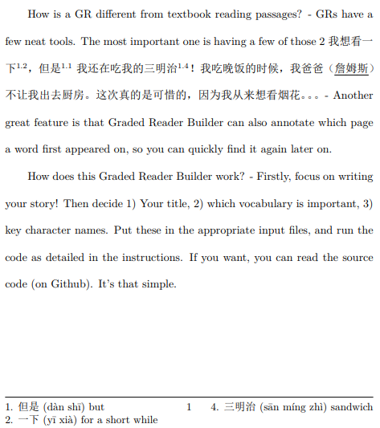
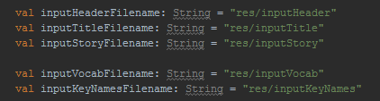
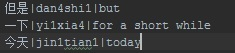

# Graded-Reader-Builder
Graded Reader Builder lets people create professional-quality graded readers from simple text input (story, vocab, characters, etc.). A wealth of high-quality books written by language learners, for language learners can be produced by this tool - and can be openly shared on an open-source graded reader database website (todo).

###### 1. Graded Reader Builder Input & Output
###### 2. Features
###### 2. Windows Setup Guide
###### 3. To-do

## 1. Graded Reader Builder Input & Output

The example pdf is available [here](../examples/ExampleGradedReader.pdf)

## 2. Features
## Supported language pairs:
* L2 Mandarin (Hanzi/Hanzi(+pinyin in footers), L1 English
* L2 English, L1 Mandarin (TESTING)

## Graded-reader features:
* All vocabulary words are superscripted in the story, with the form "page.vocab number".
* Each page with new vocabulary has left and right footers (which will split e.g. 3 words into 2 on the left, 1 on the right).
* Key names are underlined in the story.

## 3. Windows Setup Guide
###### This should be defunct when a GUI/installer is made
1. Make a Github account and fork this project (to make your own local version). This seems to be the easiest way to get it running on your PC late on.

2. Download & install [IntelliJ Community Edition](https://www.jetbrains.com/idea/download/#section=windows). It's free - just make sure to get the one appropriate for your operating system!

3. Get [MiKTeX](https://miktex.org/download), and install. I chose "Install missing package on the fly.".

4. In IDEA, "check out from version control" -> Github -> login -> repo URL "https://github.com/YOUR-USERNAME/Graded-Reader-Builder.git"

5. In IDEA, click on Graded-Reader-Builder/src/main.kt (at the top left). IDEA will say "Project SDK not defined", so you need to get the java SDK.

6. Get the latest [Java jdk - here is jdk9](http://www.oracle.com/technetwork/java/javase/downloads/jdk9-downloads-3848520.html). Install. Point IDEA to the install folder (C:\Progam Files\Java\jdk-9.0.4 for me)

7. Wait for IDEA to index. It'll probably ask to update Kotlin.

8. Hit File -> Project Structure -> Project Settings -> Libraries -> Add JARs, and choose the libs folder at "C:\Users\YourUsername\IdeaProjects\Graded-Reader-Builder\libs".

9. In the "res" folder, replace the input file contents with your content (following the example format).

10. At the top of IDEA, press "Run", then "run", then choose "Main.kt"

11. Code will run, and in a command window (bash) xelatex will get the required packages/files. This could take quite a few minutes.

If using a LaTeX studio (I was using TeXStudio before automating LaTeX->pdf with miktex(/xelatex), then you may need to: 
* Install packages (mostly for CJK/pinyin)
* Compile with XeLaTeX (Options -> configure TeXstudio -> build tab (on left) -> default compiler: XeLaTeX)

**Please make requests/suggestions & report issues with the GitHub "Issue" tool, or do a Pull Request. Even if you help with something small, you can help this tool reach it's potential! Thanks!**
